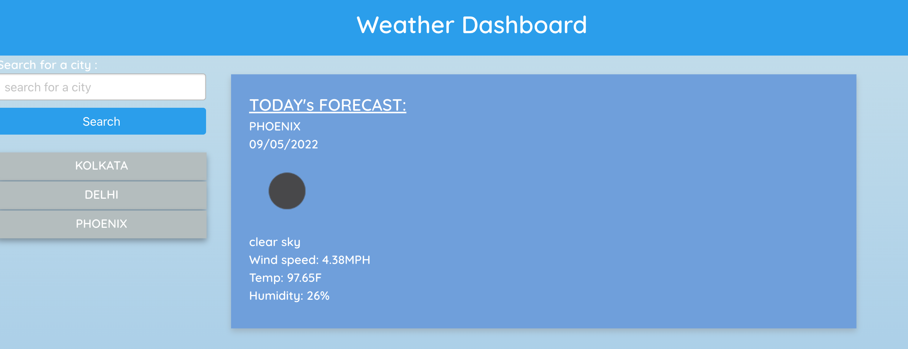
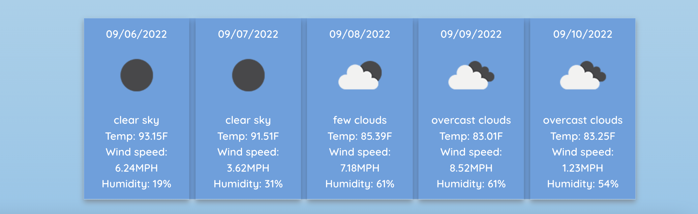

# Weather-dashboard
## Description

The project is about learning how to invoke third party API's and use the data fetched from the third party API's and use that data to create a dashboard. In this dashboard I have called open weather third party API to get current and  5 day forecast data and have used that data to create weather dashboard. This app uses moment.js to use date and time.

Third Party API used in this project - https://openweathermap.org/api/one-call-api

## Table of Contents
* [Installation](#installation)
* [Usage](#usage)
* [License](#license)
* [Tests](#tests)
* [Deployed Site](#deployed)
* [Contact](#contact)

## Installation 
No installation needed. 

## Usage 
The project is to get current weater and also to get 5 days forecast.  

## License 
This project is license under MIT

## Tests
There are no tests for this application.

## Deployed
Code deployed at https://jayita87.github.io/Weather-dashboard/

## Contact
If you have any questions about this projects, please contact me directly at jayita.chowdhury.1987@gmail.com. You can view more of my projects at https://github.com/jayita87.
